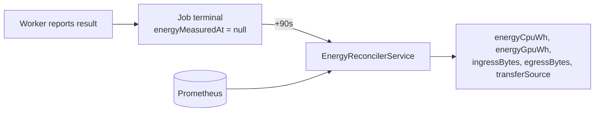
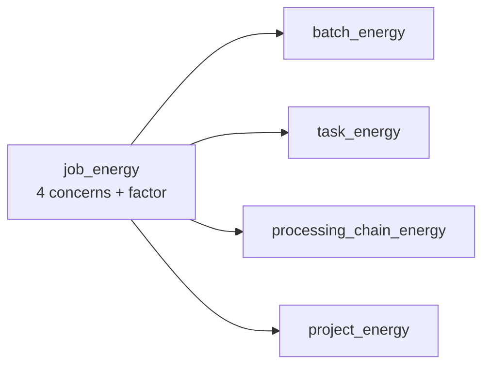

# Environmental footprint

DPMC estimates the **energy consumed** and **CO₂ emissions** of every production. This is a first-class goal: large-scale reprocessing has an environmental cost that we want to **measure** and **compare**.

The reference model is **DAMPS.ACR.DOC.031 §Carbon footprint**, which scopes the assessment to three activities — _Computation_, _Transfer_, _Storage_:

```
total CO2e_project = Σ_j ( CO2e_computation,j + CO2e_transfer,j + CO2e_storage,j )
```

Computation and Transfer are implemented. Storage is designed in the doc and not yet built. Compute is additionally split between CPU and GPU, which the doc does not distinguish, giving **four concerns**:

| Concern   | Doc activity | What it covers                | Source                                             |
| --------- | ------------ | ----------------------------- | -------------------------------------------------- |
| `cpu`     | Computation  | Compute on the host CPU       | `cpuSeconds` reported by the worker × W/core       |
| `gpu`     | Computation  | Compute on the GPU            | `DCGM_FI_DEV_POWER_USAGE`, integrated over the run |
| `ingress` | Transfer     | Bytes pulled in for the job   | cAdvisor, or the worker's staged volumes           |
| `egress`  | Transfer     | Bytes pushed out by the job   | cAdvisor, or the worker's staged volumes           |

## The base unit: the Job

Each `Job` carries, once it is terminal:

- `energyCpuWh` / `energyGpuWh` — compute energy, in Wh,
- `energyMeasuredAt` — when the reconciler filled them in,
- `startedAt` / `endedAt` — the duration,
- `metrics` (JSON) — `cpuSeconds`, `diskReadBytes`, `diskWriteBytes`, `ingressBytes`, `egressBytes`, `transferSource`,
- `avgPower` — the legacy single-figure estimate, kept as a fallback for jobs that ran before the split existed.

There is deliberately **no** `energyIngressWh` column. Transfer energy is `Volume × Intensity`, and the intensity is a property of the site, so the `job_energy` view derives it from the stored byte counters — recalibrating a data centre then corrects its history retroactively, exactly as it already does for `pue`.

### How the concerns are computed

```
cpu_wh     = cpuSeconds × wattsPerCore / 3600
gpu_wh     = avg(gpu_watts) × duration_h
ingress_wh = ingress_bytes / 1e9 (Go) × DataCenter.energyIntensity (kWh/Go) × 1000
egress_wh  = egress_bytes  / 1e9 (Go) × DataCenter.energyIntensity (kWh/Go) × 1000
```

`wattsPerCore` is `Host.tdpW / Host.nbCores` when the host declares its TDP, and the `ENERGY_W_PER_CORE` fallback otherwise — a hardware property, which is why it is not held on the DataCenter.

### Two sources for transfer, and why the provenance is recorded

| `transferSource` | Where the bytes come from                     | Blind to                                                |
| ---------------- | --------------------------------------------- | ------------------------------------------------------- |
| `cadvisor`       | Staged volumes **plus** the job pod's own network | nothing                                             |
| `staged`         | What the worker staged in and out for the job | inputs a script fetches itself (the `dpmc_io` contract) |
| `none`           | neither available                             | everything; the transfer concerns report 0              |

The two sources are **additive**, not competing: staged data moves over the _worker's_ interface into the shared volume, so the job pod's counters never see it; `dpmc_io` self-fetch moves over the _pod's_ interface, which staging never sees. When cAdvisor answered, the job gets the sum of both. cAdvisor needs a **privileged DaemonSet** (`hostNetwork`, `hostPID`, `hostPath`), which a namespace enforcing the `restricted` Pod Security profile rejects outright — on those clusters `staged` is the only source there will ever be.

The provenance is stored on every job and surfaced in the console, because `0 g of ingress` means something very different depending on whether nothing was transferred or nothing was measured. A batch whose jobs were not all measured the same way is flagged as such.

:::warning[Measurement] What ingress/egress really counts
Neither source is WAN transfer. On a cluster whose object store runs in the same cluster, staging inputs from MinIO counts exactly like a download from outside would. Splitting east-west from WAN traffic needs eBPF-level accounting (Cilium/Hubble), which is not in place.
:::

:::info[Divergences] Where the implementation differs from DAMPS.ACR.DOC.031

- **Transfer emission factor.** The doc bills each flow at the factor "of the main location of the route". DPMC has no network-route model, so the factor of the data centre at the end of the route is used.
- **Flow types.** The doc indexes intensity per flow type (`Intensity_i`); the schema carries one `energyIntensity` per site, applied to both directions.
- **Units.** The doc quotes emission factors in kgCO₂/kWh and totals in kgCO₂. The schema stores gCO₂/kWh (the seed uses `60` for the French mix) and the API returns grams, which `formatCo2` scales for display.
- **Computation formula.** The doc writes `CO2e = (Pavg × t / 1000) × PUE` and labels the result kgCO₂ — that product is kWh, the emission factor is missing. The implementation applies `× emissionFactor`, without which the figure is an energy, not an emission.
- **GPU.** Not a concern in the doc; added here because GPU nodes are in scope for scheduling and their draw is far from negligible.

:::

## Collection: out of band, not at job completion

Network and GPU counters are **not** read when the worker reports its result. At that instant the job's last cAdvisor scrape has not happened yet, so the tail of its traffic is missing, and the pod is about to be reaped by `ttlSecondsAfterFinished`.

Instead, `EnergyReconcilerService` runs every minute and picks up jobs that ended more than `ENERGY_RECONCILE_DELAY_S` ago:



If Prometheus is unreachable the job is left for the next tick rather than recorded as a measured zero. Past `ENERGY_RECONCILE_MAX_AGE_S` it is written with whatever is available, so an outage cannot build a backlog that never drains.

Job completion therefore never depends on the monitoring stack being up.

## Attribution in Prometheus

cAdvisor reports on `(namespace, pod)`; DPMC reasons in job ids. The worker labels every job pod with `dpmc/job-id`, kube-state-metrics publishes it as `kube_pod_labels`, and **recording rules** do the join once so the API queries a single series per concern:

```
dpmc:job_network_receive_bytes:total
dpmc:job_network_transmit_bytes:total
dpmc:job_cpu_usage_seconds:total
dpmc:job_gpu_power_watts
```

These counters are created with the job pod and destroyed with it, so the API reads them with `max_over_time()` rather than `increase()` — there is no counter to extrapolate, the maximum _is_ the job total.

## Aggregation via SQL views

`job_energy` is the single definition of a job's footprint; every rollup is a plain `SUM` over it.



| View                      | Aggregates…           |
| ------------------------- | --------------------- |
| `job_energy`              | one row per Job       |
| `batch_energy`            | the Jobs of a Batch   |
| `task_energy`             | the Jobs of a Task    |
| `processing_chain_energy` | the Jobs of a chain   |
| `project_energy`          | the Jobs of a project |

Each exposes `*_wh` and `*_co2_grams` per concern plus the totals. `MetricsCo2Service`, `BatchService` and the Prometheus gauges all read these views — there is deliberately no second copy of the formula anywhere in the codebase.

## From Wh to gCO₂eq

Energy is converted to emissions using the indicators of the **`DataCenter`** that hosts the Host **that ran the job**:

```
emissions (gCO₂eq) = energy_wh / 1000 × pue × emissionFactor
```

- **`pue`** (_Power Usage Effectiveness_) — infrastructure overhead (cooling, etc.). Ideally close to `1.0`.
- **`emissionFactor`** — gCO₂eq per kWh of the local electricity mix.

The per-job attribution is what makes carbon-aware placement observable: the same 157 Wh workload reports **11.3 gCO₂eq** on a site at `pue 1.2 / 60 gCO₂eq per kWh` and **201 gCO₂eq** on one at `pue 1.6 / 800`. A fleet-wide average would report the same figure for both and make the decision invisible.

When a job has no host — never allocated, or the host has since been deleted — the fleet average is used as a fallback, so the job still reports something rather than disappearing from the totals.

## Exposure

- `GET /metrics/co2?groupBy=project|task|chain&from=&to=` — aggregates with an `energyWhByConcern` and `co2GramsByConcern` breakdown.
- `GET /metrics` — `dpmc_energy_wh` and `dpmc_co2_grams` gauges, labelled by `project` and `concern`, scraped by the `dpmc-api` job.

## Where each coefficient lives

Per-site coefficients belong to `DataCenter`, because the whole point of multi-site placement is that they differ between sites:

| Coefficient       | Unit     | Seed value | Used for                 |
| ----------------- | -------- | ---------- | ------------------------ |
| `pue`             | ratio    | `1.5`      | Computation and Transfer |
| `emissionFactor`  | gCO₂/kWh | `60`       | Computation and Transfer |
| `energyIntensity` | kWh/Go   | `0.02`     | Transfer                 |

The rest is API configuration, either because it is a hardware property with a per-Host override, or because it is not part of the energy model at all:

| Variable                      | Default | Meaning                                       |
| ----------------------------- | ------- | --------------------------------------------- |
| `ENERGY_W_PER_CORE`           | `15`    | Fallback per-core draw when `tdpW` is unset   |
| `ENERGY_RECONCILE_DELAY_S`    | `90`    | Wait before reading a finished job's counters |
| `ENERGY_RECONCILE_MAX_AGE_S`  | `86400` | Past this, measure with what is available     |
| `ENERGY_RECONCILE_BATCH_SIZE` | `50`    | Jobs measured per tick                        |

Transfer intensity is the shakiest figure in the model: published estimates for fixed networks span roughly an order of magnitude. `0.02 kWh/Go` is the project's reference value and is meant to be recalibrated per site.

:::tip[Design] Refinements
The **storage** activity from the doc (`kWh/To·month`, derived from `dataVolume`), per-flow-type intensities, route-based emission factors, the east-west vs WAN traffic split, the carbon attribution for _cloud-bursting_ placements, and the per-concern graphs in the console are all still open.
:::

## See also

- [Host, DataCenter and Pool](/docs/concepts/host-datacenter)
- [Task, Batch and Job](/docs/concepts/task-batch-job)
- [Multi-site](/docs/architecture/multi-site)
