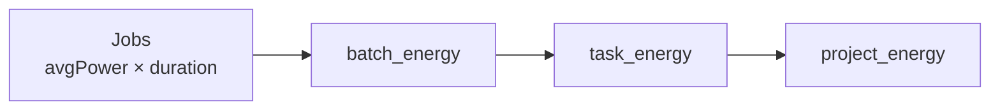

# Environmental footprint

DPMC estimates the **energy consumed** and **CO₂ emissions** of every production. This is a first-class goal: large-scale reprocessing has an environmental cost that we want to **measure** and **compare**.

## The base unit: the Job

Each `Job` collects at execution time (on the worker):

- `avgPower` — average power (W) during the run,
- `startedAt` / `endedAt` — the duration,
- `metrics` (JSON) — `cpuSeconds`, `diskReadBytes`, `diskWriteBytes`…,
- `dataVolume` — volume of data produced.

The energy of a Job is therefore:

```
energy_wh = avgPower (W) × duration (h)
```

## Aggregation via SQL views

Three **PostgreSQL views** (migration `1_energy_views`) roll energy up along the hierarchy:



| View             | Aggregates…                              | Exposes                                       |
| ---------------- | ---------------------------------------- | --------------------------------------------- |
| `batch_energy`   | the Jobs of a Batch                      | `cpu_seconds`, `disk_read/write_bytes`, `energy_wh` |
| `task_energy`    | the Batches of a Task                    | `cpu_seconds`, `energy_wh`                    |
| `project_energy` | the Tasks of a project                   | `cpu_seconds`, `energy_wh`                    |

These views are consumed by the API's `MetricsCo2Service` (`refreshCo2` / `aggregate`).

## From Wh to gCO₂eq

Energy is converted to emissions using the indicators of the **`DataCenter`** that hosts the Host:

```
emissions (gCO₂eq) = energy_wh / 1000 × pue × emissionFactor
```

- **`pue`** (*Power Usage Effectiveness*) — infrastructure overhead (cooling, etc.). Ideally close to `1.0`.
- **`emissionFactor`** — gCO₂eq per kWh of the local electricity mix.

A data center on a low-carbon mix (e.g. `pue = 1.5`, `emissionFactor = 60` gCO₂eq/kWh) will produce dramatically lower emissions than one on a coal-heavy mix (≈ 800 gCO₂/kWh) — hence the value of **carbon-aware multi-site placement**.

## The role of TDP

The `Host.tdpW` field (thermal design power, W) serves as a **fallback** when `avgPower` is not measured, and as an upper bound for estimating a Job's consumption before it runs.

:::tip[Design] Refinements
The **storage** and **network transfer** share (derived from `dataVolume` and `diskBytes`), the carbon attribution for *cloud-bursting* placements, and the exposure of these metrics in the console (per-project graphs) are all in progress.
:::

## See also

- [Host, DataCenter and Pool](/docs/concepts/host-datacenter)
- [Task, Batch and Job](/docs/concepts/task-batch-job)
- [Multi-site](/docs/architecture/multi-site)
