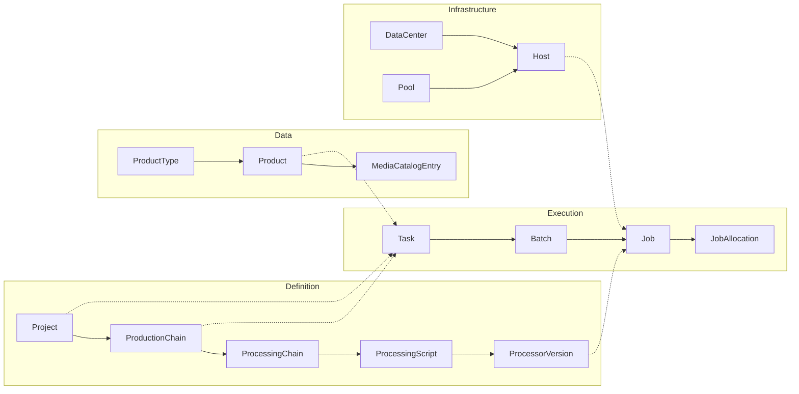
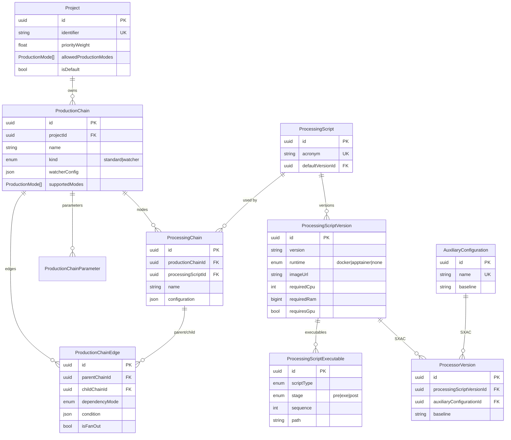
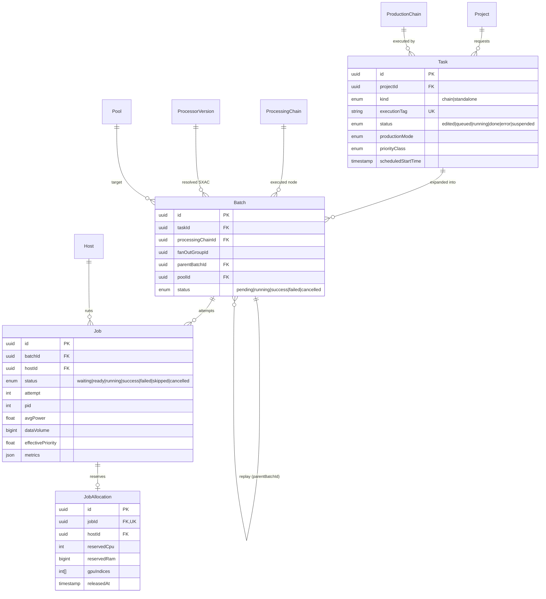
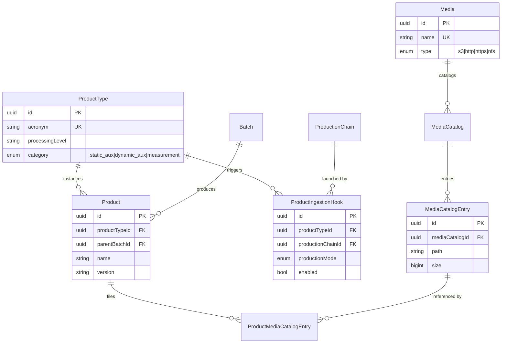
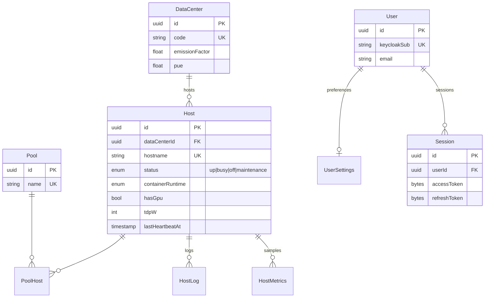

# Data model

This page reflects the actual Prisma schema (`packages/prisma/prisma/schema.prisma`). The model has roughly thirty entities; to stay readable, it is presented in **functional blocks**.

## Block map

## Definition block

## Execution block

## Data block

## Infrastructure & Identity block

## Cross-cutting conventions

- **Primary keys** — `uuid` everywhere.
- **Timestamps** — `createdAt` / `updatedAt` as `timestamptz`. Lightweight audit via `createdBy` / `updatedBy`.
- **Soft delete** — `deletedAt` on definition entities (`Project`, `ProductionChain`, `ProcessingScript`, `Task`, `Batch`, `AuxiliaryConfiguration`).
- **Energy views** — `batch_energy`, `task_energy`, `project_energy` (migration `1_energy_views`); see [Carbon footprint](/docs/architecture/carbon-footprint).
- **Ingestion trigger** — `fn_product_ingestion_hook` on `INSERT product`; see [Triggering](/docs/architecture/triggering).

## Why this model?

- **Task → Batch → Job hierarchy** — separates the *request*, the *step*, and the *process*, and enables replay, fan-out, and retries without losing traceability.
- **Nodes + edges** (`ProcessingChain` / `ProductionChainEdge`) — a script reusable several times within a chain, with properties carried by the edge.
- **SXAC** (`ProcessorVersion`) — the software × ADF coexistence, essential for operational reprocessing.
- **Decoupled catalog** — a product independent from its storage location(s).

## See also

- [Detailed concepts](/docs/concepts/overview)
- [Roadmap](/docs/roadmap)
