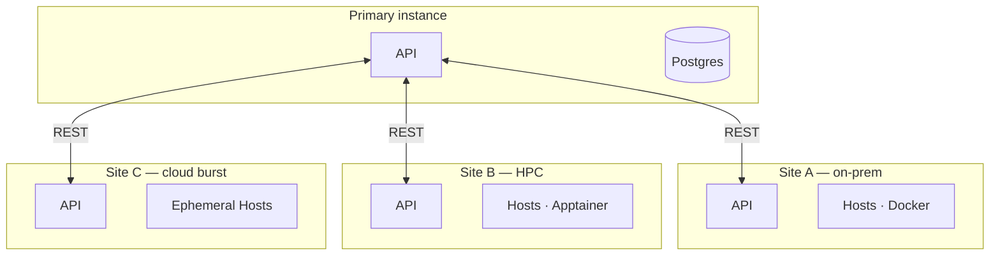

# Multi-site and primary/secondary

:::tip[Design] Target vision
This page describes a **design intent**. The foundations are in place in the data model (decoupled media catalog, `DataCenter`, `Pool`, API-first), but full cross-instance coordination is still largely a design topic.
:::

DPMC is designed to run as **multiple coordinated instances**, each owning its site (a data center, a cloud, an HPC cluster). The goal: process data **where it lives** or **where it is cheapest / lowest-carbon**, without needlessly moving petabytes around.

## Target scenarios

| Scenario               | Idea                                                                              |
| ---------------------- | --------------------------------------------------------------------------------- |
| **Federation**         | Multiple data centers share a catalog and split campaigns between themselves.     |
| **Cloud-bursting**     | Overflow to a cloud when on-prem Hosts are saturated (reprocessing peaks).        |
| **Disaster recovery** | One site takes over from another that has become unavailable.                     |
| **Carbon placement**   | Route the load to the site with the cleanest electricity mix (see [Carbon footprint](/docs/architecture/carbon-footprint)). |

## What makes this design possible

- **API-first** — each instance is drivable via REST API, so one instance can drive another.
- **Decoupled catalog** (`Media` / `MediaCatalog` / entries) — the same `Product` can exist on multiple media and sites without duplicating its definition.
- **Per-project runtimes** — Docker on-prem, Apptainer on HPC: a project can run on sites of different natures.
- **Hosts / DataCenters / Pools** — infrastructure is already modeled by site and by logical grouping.

## Open design questions

- Coordination topology (single primary vs peers), and propagation of Tasks/products between instances.
- Distributed catalog consistency and deduplication.
- Cross-site placement policy (cost, latency, carbon, data sovereignty).
- Cross-instance security (beyond the user JWT and the worker token).

## See also

- [Architecture overview](/docs/architecture/overview)
- [Carbon footprint](/docs/architecture/carbon-footprint)
- [Roadmap](/docs/roadmap)
