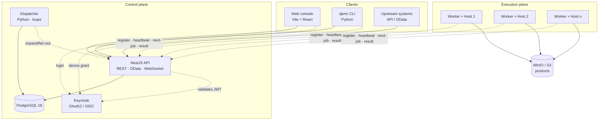
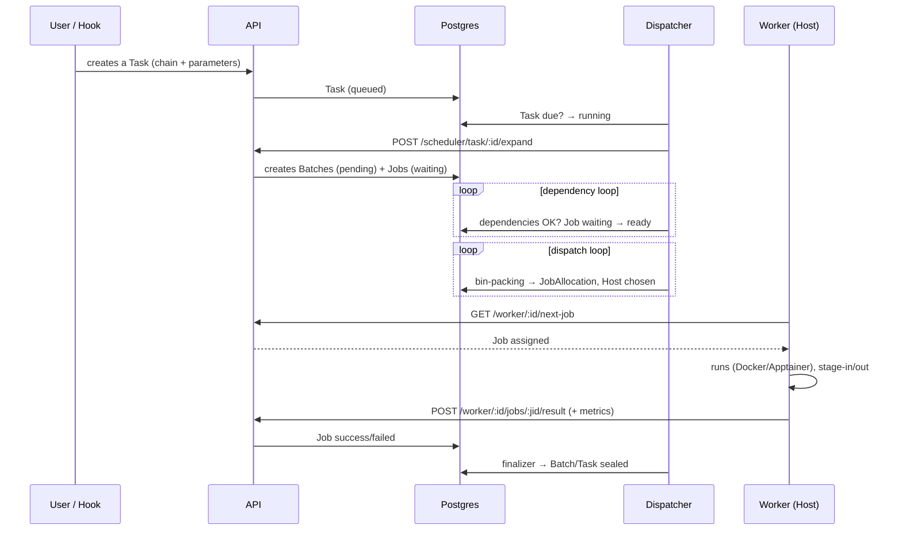

# Architecture overview

DPMC is an **API-first** and **container-native** system: every database access goes through the API, and execution runs in containers. The components are split between a **control plane** (API, database, dispatcher) and an **execution plane** (workers on Hosts).

## Components

| Component      | Stack                         | Role                                                                            |
| -------------- | ----------------------------- | ------------------------------------------------------------------------------- |
| **API**        | NestJS (Node 24)              | The sole gateway to the database. REST + OData v4, WebSocket `/monitoring`, auth. |
| **Web**        | Vite + React 19, TanStack     | Operator console: dashboards, monitoring, configuration. Map (Leaflet), graphs (xyflow). |
| **CLI**        | Python (Typer)                | `dpmc` — Keycloak login (device grant), OData queries.                          |
| **Dispatcher** | Python (psycopg async)        | The orchestration engine: task/dependency/dispatch/monitor/aging/watcher/finalizer loops. *(submodule `dpmc-dispatcher`)* |
| **Worker**     | Python (httpx)                | Agent on every Host: registers, *heartbeats*, runs Jobs (Docker/Apptainer), reports logs and metrics. *(submodule `dpmc-worker`)* |
| **PostgreSQL** | Postgres 18                   | Source of truth (Prisma schema), triggers, energy views.                        |
| **Keycloak**   | Keycloak 26                   | Identity, OAuth2/OIDC, RBAC roles.                                              |
| **MinIO**      | S3-compatible                 | Product storage (`s3` media).                                                   |

:::note Submodules
`apps/worker` and `apps/dispatcher` live in separate repositories, integrated as **git submodules**. The API and the TypeScript client (`packages/client`) live in this monorepo.
:::

## The flow of a production

## Pull model for execution

The "pull or push" question (open in the initial design) is settled: it is a **pull** model. The worker **polls** the API (`GET /worker/:id/next-job`) rather than receiving an order. The dispatcher only **decides** (allocation); the worker **pulls** the work assigned to it. This is robust against restrictive networks and NAT (the worker only needs outbound HTTP access to the API).

## API: REST, OData and real-time

- **REST** — resources `products`, `tasks`, `batches`, `jobs`, `hosts`, `production-chains`, `processing-scripts`, `projects`, `pools`, `processors`, and so on.
- **OData v4** — `/odata/:resource` for rich queries (`$filter`, `$select`, `$expand`, `$orderby`, pagination). Public reads, writes restricted to `operator`+ roles. This is what the CLI consumes.
- **WebSocket** — `/monitoring` namespace (Socket.io) for real-time tracking of Jobs/Batches/Hosts in the console.
- **Typed client** — `packages/client` (`@dpmc/client`) exposes **ts-rest** contracts + **zod** schemas shared between the web console and TypeScript integrations.

## Technical choices

| Item                 | Choice                        | Why                                                                       |
| -------------------- | ----------------------------- | ------------------------------------------------------------------------- |
| Database             | PostgreSQL 18                 | Relational, fits the DAG, JSONB, triggers, materializable views.          |
| ORM / migrations     | Prisma                        | Typed client, versioned migrations.                                       |
| API                  | NestJS                        | Modularity, DI, mature ecosystem, OpenAPI.                                |
| Frontend             | Vite + React 19 + TanStack    | Reactive SPA, file-based routing, React Query, real-time.                 |
| Dispatcher / Worker  | Python                        | Closeness to the scientific processing ecosystem.                         |
| Monorepo             | pnpm + Turborepo              | Build cache, shared tasks.                                                |
| Identity             | Keycloak (OAuth2/OIDC)        | RBAC, device grant for the CLI, ecosystem standard.                       |
| Containers           | Docker (cloud/on-prem), Apptainer (HPC) | No Kubernetes required; HPC without root privileges.           |

## See also

- [Data model (ERD)](/docs/architecture/data-model)
- [Scheduler](/docs/architecture/scheduler)
- [Security](/docs/architecture/security)
- [Multi-site](/docs/architecture/multi-site)
