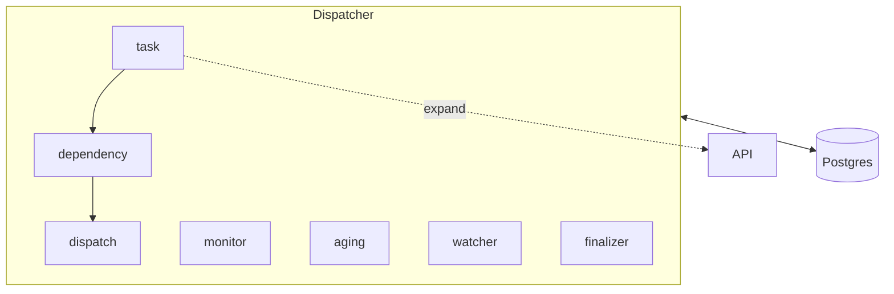
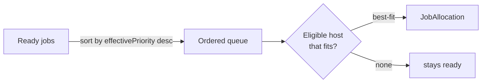

# Scheduler — the dispatcher

The **dispatcher** (`apps/dispatcher`, Python submodule) is the orchestration engine. It is a long-running service that runs several concurrent **loops**, each with its own interval. It reads and writes **directly** to PostgreSQL (psycopg async) and calls the API only for Task **expansion** and **fan-out**.



## The loops

| Loop            | Responsibility                                                                                  | Main transition                           |
| --------------- | ----------------------------------------------------------------------------------------------- | ----------------------------------------- |
| **task**        | Promotes `queued` Tasks whose `scheduledStartTime` is due → `running`, and triggers their **expansion** (`POST /scheduler/task/:id/expand`) on the API side. | Task `queued → running` |
| **dependency**  | Resolves dependencies: for each `waiting` Job, examines the state of parent Jobs (via the edges) and the `dependencyMode`. | Job `waiting → ready` or `→ skipped`      |
| **dispatch**    | Assigns `ready` Jobs to Hosts using **bin-packing**, creates the `JobAllocation`s.              | Creates the allocation (the worker then picks up the Job) |
| **monitor**     | Detects `running` Jobs on lost Hosts (expired heartbeat), fails them, and releases their allocations. | Job `running → failed` + release          |
| **aging**       | Periodically recomputes `Job.effectivePriority` to avoid starvation.                            | Updates `effectivePriority`               |
| **watcher**     | Automatically creates Tasks for `ProductionChain`s of kind `watcher`, according to their config. | Creates Tasks                             |
| **finalizer**   | Seals Batches/Tasks once all their children reach a terminal state.                              | Batch → `success/failed/cancelled`, Task → `done/error` |

## Dependency loop

For a child Job in `waiting`, the dispatcher aggregates the states of its parents (sibling Jobs with the same `executionTag`, connected through `production_chain_x_edge`) and applies the mode:

| `dependencyMode`    | `ready` if…                                  | `skipped` if…                                |
| ------------------- | -------------------------------------------- | -------------------------------------------- |
| `on_success`        | **all** parents `success`                    | one parent `failed` / `skipped` / `cancelled` |
| `on_failure`        | **≥ 1** parent `failed`                      | all finished with no failure                 |
| `on_completion`     | **all** parents finished (any state)         | —                                            |
| `optional`          | always (never blocking)                      | —                                            |
| `on_data_available` | a Product of the expected type is in the catalog | — (waits until available)                 |

`on_data_available` is evaluated by the dependency loop: it reads the
`productTypeId` from the edge's `dataAvailable` condition and promotes the
child once a matching Product exists in the catalog (otherwise the child keeps
waiting; it never skips on this mode).

Resolution is **idempotent**: replayed at every tick without side effects.

## Dispatch loop: Best-Fit-Decreasing

### Effective priority

`ready` Jobs are sorted by **descending effective priority**:

```
effectivePriority = priority × CLASS_WEIGHT[priorityClass] × project.priorityWeight + agingBoost
```

- **`CLASS_WEIGHT`** — `test`=0.5, `on_demand`=1.0, `reprocessing`=1.2, `nrt`=5.0, `super`=100, `ultra`=1000.
- **`project.priorityWeight`** — [weighted fairness between projects](/docs/concepts/project#weighted-fairness-between-projects).
- **`agingBoost`** — `AGING_COEF × min(age_in_seconds, AGING_CAP)`, i.e. ≈ `0.01`/second capped at 24 h. A waiting Job slowly climbs, guaranteeing it will eventually run (anti-starvation).

### Placement (bin-packing)

For each Job, in priority order:

1. **Filter** eligible Hosts: `status = up`, compatible container runtime, **available** CPU/RAM/disk/GPU (capacity minus current reservations).
2. **Pick the best fit** (*Best-Fit*): the Host whose remaining capacity after placement is the **smallest** — already-loaded machines fill up first, which **minimizes fragmentation**.
3. **Reserve**: create a `JobAllocation` (CPU/RAM/disk + contiguous `gpuIndices`) and decrement free capacity **in memory** for the rest of the tick.



Placement is **GPU-aware**: free GPU indices are tracked per Host and allocated contiguously.

## Monitor loop

A Host whose `lastHeartbeatAt` exceeds a threshold is considered lost. Each of its `running` Jobs is run through the **retry policy**: its `JobAllocation` is released, `attempt` is incremented, and the Job is either re-queued for another run or left terminally `failed`. Startup `recovery` applies the same policy to orphan `running` Jobs left behind by a crash.

### Retry policy

Only **infrastructure** failures (host lost) are retried here — a worker that reports a Job `failed` for a deterministic processing reason is left terminal by the API, since re-running it would only fail again.

On each infra failure the Job's `attempt` is bumped. While `attempt < max_attempts` (default `3`) the Job goes back to `ready` with `expectedStartTime` set in the future — an **exponential backoff** of `base · multiplier^(attempt−1)` seconds, clamped to a cap (defaults: base `30s`, multiplier `2`, cap `1h`). The `dispatch` loop only allocates `ready` Jobs whose `expectedStartTime` has passed, so the backoff is honoured without a dedicated state. Its run-state (`hostId`, `pid`, `startedAt`, `endedAt`) is cleared so it is allocated afresh.

Re-queueing to `ready` (not `waiting`) is deliberate: `waiting → ready` promotion is dependency-driven and only fires for chain Jobs, so a standalone retry would otherwise be stranded.

Once `attempt` reaches `max_attempts` the Job stays `failed` (with `lastError`) and the dispatcher logs an `error`-level **`RETRY EXHAUSTED`** line for operator escalation. All thresholds are configurable via `DPMC_DISPATCHER_MAX_ATTEMPTS`, `…_RETRY_BACKOFF_BASE_S`, `…_RETRY_BACKOFF_MULTIPLIER`, `…_RETRY_BACKOFF_CAP_S`.

## Pull model

The dispatcher **does not push** Jobs to Hosts. It decides (allocation); the **worker pulls** its work via `GET /worker/:id/next-job`. See [Overview](/docs/architecture/overview#pull-model-for-execution).

:::tip[Design] Still open
Fine-grained **affinity** constraints (beyond `poolId` and runtime) are work in progress.
:::

## See also

- [Task, Batch and Job](/docs/concepts/task-batch-job)
- [Project — fairness](/docs/concepts/project)
- [Host, DataCenter and Pool](/docs/concepts/host-datacenter)
