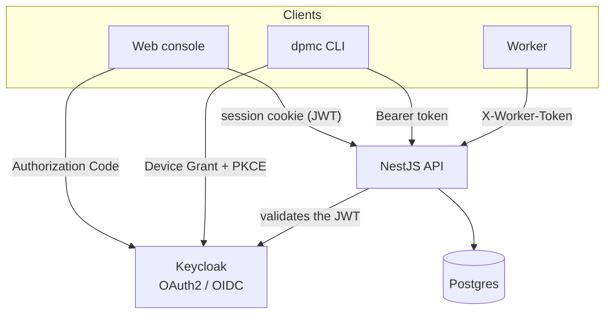

# Security

DPMC enforces a simple principle: **all access to data goes through the API**, and the API is the only point that authenticates and authorizes. Identity is delegated to **Keycloak** (OAuth2 / OIDC).

## Authentication

| Client       | Flow                                                      | Token storage                              |
| ------------ | --------------------------------------------------------- | ------------------------------------------ |
| **Web console** | OAuth2 *Authorization Code* via `/auth/login` → callback | **HTTP-only** cookie; session on the API side. |
| **CLI**      | OAuth2 *Device Authorization Grant* (RFC 8628) + PKCE      | `~/.dpmc/credentials.json`, auto refresh.  |
| **Worker**   | Shared secret `X-Worker-Token` (no user)                   | `DPMC_WORKER_TOKEN` env var.               |

### Sessions

A `Session` is created on web sign-in: it stores `accessToken` / `refreshToken` **encrypted** (`Bytes`), their expirations, and metadata (`userAgent`, `ipAddress`, `lastSeenAt`). The user (`User`) is tied to Keycloak via `keycloakSub`. Their preferences (`UserSettings`: theme, container size, last project) are persisted separately.

## Authorization (RBAC)

The API carries two main guards:

- **`SessionGuard`** — validates the session cookie / JWT.
- **`RolesGuard`** — enforces the roles declared by `@Roles(...)` on each route. `@Public()` opens a route (login, callback), `@ProjectScoped(...)` restricts it to the user's project.

Four RBAC roles:

| Role              | Can…                                                              |
| ----------------- | ----------------------------------------------------------------- |
| `external-viewer` | restricted read access (external consultation).                   |
| `internal-viewer` | full internal read access.                                        |
| `operator`        | + write: create/drive Tasks, import, act on Jobs.                 |
| `admin`           | + administration: projects, users, configuration.                 |

On **OData**, reads (`GET /odata/:resource`) are open, but any write requires `operator` or higher.

## The worker secret

Worker routes (`/host/register`, `/host/:id/heartbeat`, `/host/:id/logs`, `/host/:id/status`, `/worker/:id/next-job`, `/worker/:id/jobs/:jid/result`) carry no user identity: they are protected by a **`WorkerTokenGuard`** that checks the `X-Worker-Token` header against `WORKER_REGISTRATION_TOKEN`. The secret must be at least 20 characters long.

## Deployment (TLS & persistent Keycloak)

The API is **NestJS** (Node), configured entirely through environment variables
(`KEYCLOAK_URL`, `KEYCLOAK_REALM`, `KEYCLOAK_CLIENT_ID`, …) — there is no
`application.properties`. The issuer is derived as `${KEYCLOAK_URL}/realms/${KEYCLOAK_REALM}`
and the JWKS is fetched from it, so switching to HTTPS is purely a matter of
env values; no code changes.

**Persistent Keycloak.** Keycloak runs against a dedicated, persistent Postgres
database (`keycloak-db` in `docker-compose.yml`, via `KC_DB`) rather than the
ephemeral in-memory store. The realm is seeded once from `keycloak.json`
(`--import-realm`); admin-console changes thereafter persist across restarts.

**HTTPS termination.** An opt-in **nginx** reverse proxy (the `tls` Compose
profile) terminates TLS in front of the web console, the API, and Keycloak.
Keycloak trusts the proxy's forwarded headers (`KC_PROXY_HEADERS=xforwarded`)
so issued tokens and redirects use the external `https` scheme. Use a
self-signed cert for local HTTPS and a CA-issued cert (e.g. Let's Encrypt) in
production — modern Keycloak takes its TLS/start options as Quarkus flags and
env vars (`KC_HTTPS_CERTIFICATE_FILE`, …), not a WildFly `standalone.xml`.

See `deploy/README.md` in the repo for the exact commands, the HTTPS URL map,
and the Let's Encrypt path.

:::tip[Design] To be explored further
**Identity federation** (brokering to an external SAML/OIDC IdP) is not yet
configured — it needs a concrete target IdP. Fine-grained **user ↔ project**
mapping (beyond global roles), worker secret rotation, and full audit (beyond
the current `AuditInterceptor` and the `createdBy`/`updatedBy` fields) also
remain design topics.
:::

## See also

- [Overview — components](/docs/architecture/overview)
- [Project — multi-tenant](/docs/concepts/project)
- [Getting started — CLI](/docs/getting-started/cli)
