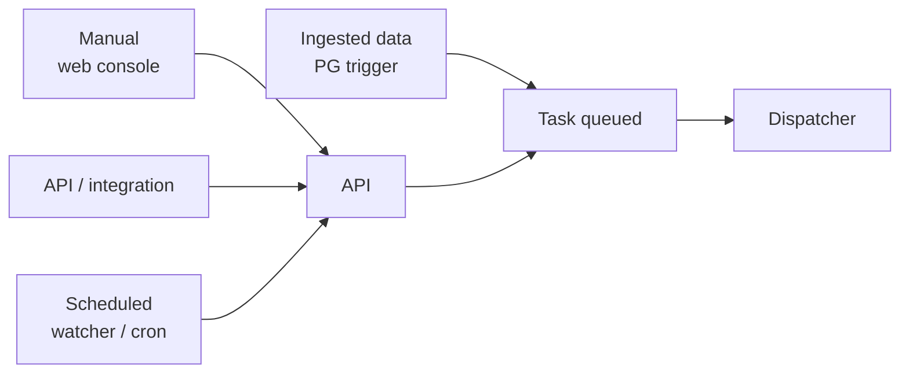
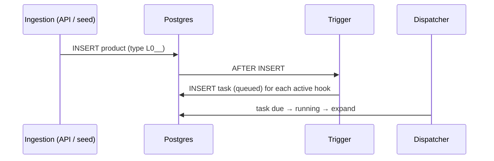

# Triggering productions

A production always starts from a **`Task`**. DPMC offers several ways to create one — this is one of the questions explicitly settled since the initial design (which planned for "manual only at MVP").



## 1. Manual

From the **web console**, an operator creates a Task: they pick the chain, fill in the [chain parameters](/docs/concepts/production-chain#chain-parameters), the mode, and the priority class. The Task lands in `queued`.

## 2. API / integration

An upstream system creates the Task via the **REST API** (or OData) — typically an external scheduler or another ground segment component. Same path as the manual one, without a UI.

## 3. Scheduled (watcher)

A `ProductionChain` of kind **`watcher`** carries a `watcherConfig`. The dispatcher's **watcher** loop creates Tasks at regular intervals (for example, to monitor the periodic arrival of data). The schemas and paths for **task-schedule** (cron presets) are defined on the client side (`@dpmc/client`) — fine-grained planning via cron expressions is being integrated.

## 4. Data-driven (ingestion)

This is the mode closest to operational use. A **`ProductIngestionHook`** says: "when a product of type *X* is ingested, launch chain *Y*." The implementation is a **PostgreSQL trigger**:

```sql
CREATE TRIGGER trg_product_ingestion_hook
  AFTER INSERT ON "product"
  FOR EACH ROW EXECUTE FUNCTION fn_product_ingestion_hook();
```

On each product insertion, `fn_product_ingestion_hook` inserts a `Task` (`status = queued`, `kind = chain`) **for each active hook** whose `productTypeId` matches, carrying over the hook's `productionMode` and pointing `productId` to the triggering product.



The seed creates two hooks: `WARHOL_SAT → Warhol chain` and `DPMC_TST_L0__ → DPMC_TST chain` (in `reprocessing`). Inserting an `L0__` product therefore automatically triggers the `L0 → L1 → L2` reprocessing.

:::note From design to code
The old docs listed triggers as an "open question (manual only at MVP)." The code has settled it: **all four modes coexist**, with the data-driven mode resting on a database trigger to guarantee that no ingestion is missed, even outside the API.
:::

## See also

- [Products and catalog](/docs/concepts/products)
- [Scheduler — watcher loop](/docs/architecture/scheduler)
- [Task, Batch and Job](/docs/concepts/task-batch-job)
