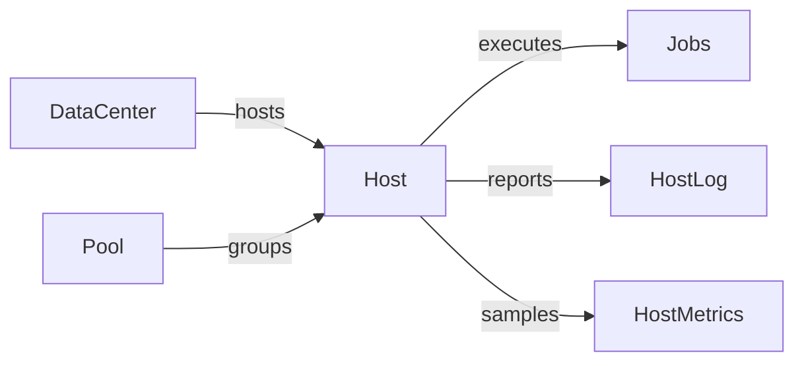
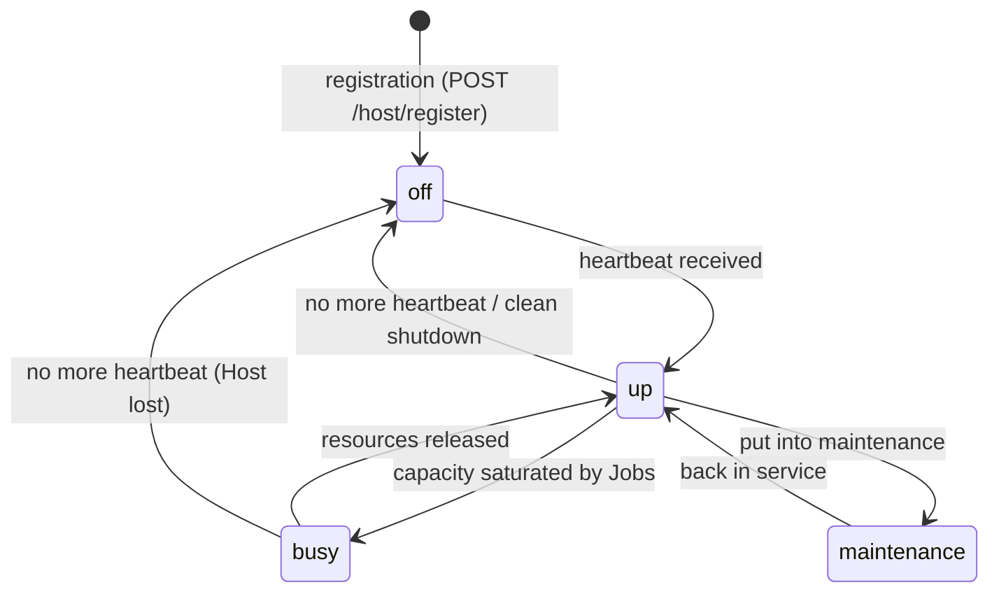

# Host, DataCenter, and Pool

The DPMC infrastructure is described by three entities: the **Host** (the machine), the **DataCenter** (where it sits), and the **Pool** (how you target it).

## Host

A **`Host`** is a machine — bare-metal, VM, or container — capable of executing Jobs. It is driven by the **worker** agent (see [Architecture](/docs/architecture/overview)).

| Field                              | Role                                                         |
| ---------------------------------- | ------------------------------------------------------------ |
| `hostname`                         | Unique machine name.                                         |
| `ipAddress`                        | Reachable address.                                           |
| `osType` / `osVersion`             | `linux`, `darwin`, `windows`, and version.                   |
| `status`                           | `up`, `busy`, `off`, `maintenance`.                          |
| `schedulingPriority`               | Scheduling preference (`low`, `medium`, `high`).             |
| `processingDir` / `cacheDir`       | Execution and cache directories.                             |
| `nbCores`                          | Declared CPU core count.                                     |
| `ram` / `disk`                     | Total RAM and disk (bytes).                                  |
| `hasGpu` / `gpuCount` / `gpuModel` | GPU capacities.                                              |
| `containerRuntime`                 | `docker`, `apptainer`, or `none` — determines eligible Jobs. |
| `tdpW`                             | Thermal envelope (W), used for energy estimation.            |
| `lastHeartbeatAt`                  | Last heartbeat received.                                     |

### Lifecycle

A Host with no heartbeat for too long is considered lost: the dispatcher's `monitor` loop **fails** its running Jobs and **releases** their allocations (see [Scheduler](/docs/architecture/scheduler#monitor-loop)).

### Registration and heartbeat

The **worker** agent calls `POST {API_URL}/host/register` on startup with the machine's characteristics (collected automatically), then emits a `POST /host/:id/heartbeat` at regular intervals. On clean shutdown, it transitions the Host to `off`. The routes are protected by a **shared secret** (`X-Worker-Token`), and the `dataCenterCode` must match an existing `DataCenter.code`. Details in [Getting started › CLI & agents](/docs/getting-started/install) and the worker's `README`.

### Logs and metrics

- **`HostLog`** — log reported by the worker (`level`, `message`, `loggedAt`), attachable to a Job.
- **`HostMetrics`** — periodic samples: `cpuLoad`, `memUsage`, `diskUsage`, `ioBandwidth`, `runningJobs`.

## DataCenter

A **`DataCenter`** groups the Hosts of a single physical site and carries the **energy indicators**.

| Field                    | Role                                                             |
| ------------------------ | ---------------------------------------------------------------- |
| `name` / `code`          | Label and short unique code.                                     |
| `latitude` / `longitude` | Geographic coordinates.                                          |
| `emissionFactor`         | gCO₂eq per kWh — specific to the local energy mix.               |
| `energyIntensity`        | kWh per Go transferred — drives the `ingress`/`egress` concerns. |
| `pue`                    | _Power Usage Effectiveness_ (ideal close to `1.0`).              |

These fields feed the [carbon footprint](/docs/architecture/carbon-footprint) calculation.

## Pool

A **`Pool`** is a **logical** grouping of Hosts (via `PoolHost`), independent of their location. It is used to **target** scheduling: a Batch can specify a `poolId` to execute only on certain machines. The seed creates two pools: `general` (small, versatile machines) and `compute` (large machines for intensive computing).

## See also

- [Scheduler — placement and allocation](/docs/architecture/scheduler)
- [Carbon footprint](/docs/architecture/carbon-footprint)
- [Task, Batch, and Job](/docs/concepts/task-batch-job)
