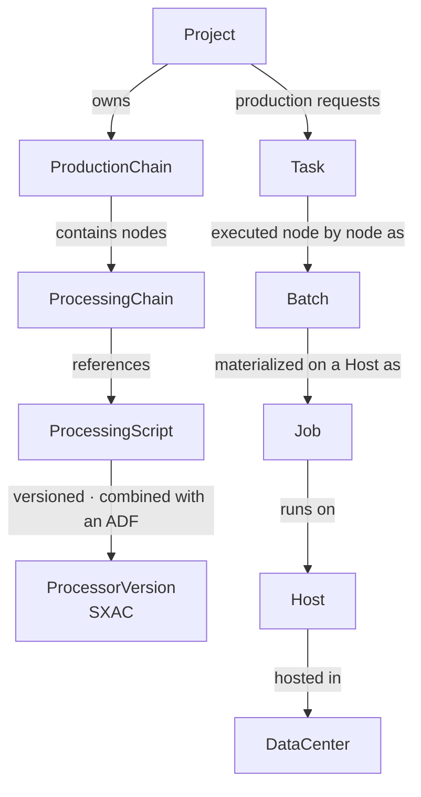

# Concepts overview

DPMC distinguishes three families of entities: what you **define**, what **executes**, and the **infrastructure** on which execution takes place. This page is the mental map; each concept has its own detailed page.

## Vocabulary

| Concept                       | Family         | Role                                                                                       |
| ----------------------------- | -------------- | ------------------------------------------------------------------------------------------ |
| **Project**                   | Definition     | Tenant: isolates data, holds permissions, fairness weight, and allowed modes.              |
| **ProductionChain**           | Definition     | A production chain (e.g. "Warhol", "DPMC_TST"), a graph of `ProcessingChain` nodes.        |
| **ProcessingChain**           | Definition     | A **node** of the chain: the use of a `ProcessingScript` at a position in the DAG.         |
| **ProductionChainEdge**       | Definition     | An **edge** of the DAG between two `ProcessingChain` nodes (dependency mode, fan-out, condition). |
| **ProcessingScript**          | Definition     | The logical identity of a processing step (e.g. `RESIZE`).                                  |
| **ProcessingScriptVersion**   | Definition     | A concrete version (runtime, image, required resources, GPU).                              |
| **ProcessingScriptExecutable**| Definition     | A file to launch within a version (stage `pre`/`exe`/`post`, sequence).                     |
| **AuxiliaryConfiguration**    | Definition     | An auxiliary data set / parameters (ADF).                                                   |
| **ProcessorVersion**          | Definition     | **SXAC** = script version × AuxiliaryConfiguration: what is actually executable.            |
| **Task**                      | Execution      | A **production request**: run a chain (or a single script) for a product.                  |
| **Batch**                     | Execution      | The execution of **a single node** of the chain as part of a Task (fan-out, replay).        |
| **Job**                       | Execution      | The concrete execution of a Batch **on a Host** (one process, one attempt).                 |
| **JobAllocation**             | Execution      | A Job's resource reservation on a Host (CPU/RAM/disk/GPU).                                  |
| **ProductType** / **Product** | Data           | Product type (level, category) and cataloged product instances.                            |
| **ProductIngestionHook**      | Data           | Rule: "if this product type arrives, trigger this chain".                                   |
| **Host**                      | Infrastructure | A compute machine that runs Jobs.                                                           |
| **DataCenter**                | Infrastructure | Physical location of a set of Hosts (geo + energy indicators).                              |
| **Pool**                      | Infrastructure | Grouping of Hosts to target scheduling.                                                     |

## How the concepts fit together

## Definition vs execution vs infrastructure

DPMC cleanly separates **definition** (static, reusable), **execution** (dated, traced instances), and **infrastructure** (the machines).

| Definition (static)              | Execution (instance)        |
| -------------------------------- | --------------------------- |
| `ProductionChain` + nodes        | `Task`                      |
| `ProcessingChain` (a node)       | `Batch`                     |
| `ProcessorVersion` (SXAC)        | `Job`                       |

This separation lets you **replay** the same chain as many times as needed, with different inputs, while keeping a precise history of every execution (down to the PID and energy consumed per Job).

## Further reading

- [Project: the tenant](/docs/concepts/project)
- [ProductionChain, nodes, and DAG](/docs/concepts/production-chain)
- [ProcessingScript, versions, and SXAC](/docs/concepts/processing-script)
- [Task, Batch, and Job](/docs/concepts/task-batch-job)
- [Products and catalog](/docs/concepts/products)
- [Host, DataCenter, and Pool](/docs/concepts/host-datacenter)
