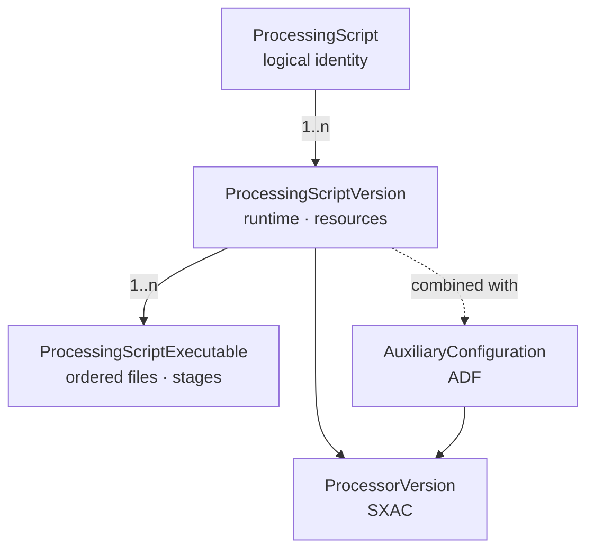
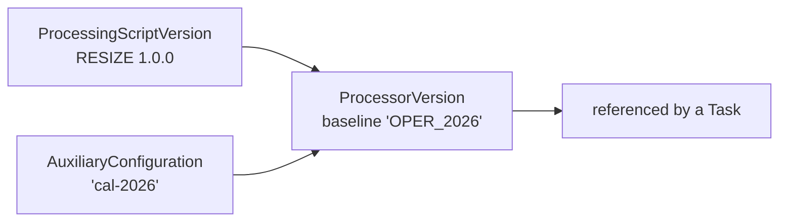

# ProcessingScript, versions and SXAC

A DPMC processing is described at several levels. This separation lets you **version** the software and its configuration independently, **pin** a version in a chain, and guarantee the **reproducibility** of past productions.

## ProcessingScript — the logical identity

A **stable** entity that designates the processing; it does not change when a new version is published.

| Field              | Role                                                          |
| ------------------ | ------------------------------------------------------------- |
| `name`             | Readable name (e.g., `Image resize`).                         |
| `acronym`          | Short **unique** acronym (e.g., `RESIZE`, `IPF_L1`).          |
| `defaultVersionId` | Version used when a chain does not specify one.               |

## ProcessingScriptVersion — a concrete version

Each evolution creates a new row, identified by a version string. It carries the **runtime** and the **resource requirements** consumed by the scheduler.

| Field           | Role                                                                |
| --------------- | ------------------------------------------------------------------- |
| `version`       | Version identifier (e.g., `1.0.0`).                                 |
| `isLatest`      | `true` for the most recently published version.                     |
| `runtime`       | `docker`, `apptainer`, or `none` (native execution).                |
| `imageUrl` / `imageTag` / `imageChecksum` | Container image and its integrity.      |
| `requiredCpu`   | Number of required CPUs.                                            |
| `requiredRam`   | Required RAM (bytes).                                               |
| `requiredDisk`  | Required disk space (bytes).                                        |
| `requiresGpu` / `gpuCount` | GPU requirement and number of cards.                     |

These resources feed the bin-packing performed by the [scheduler](/docs/architecture/scheduler).

## ProcessingScriptExecutable — the files to run

A version combines one or more **ordered** and **staged** executables.

| Field        | Role                                                              |
| ------------ | ----------------------------------------------------------------- |
| `scriptType` | `bash`, `pgbash`, `plsql`, `sql`, `python`, `binary`.             |
| `stage`      | `pre` (preparation), `exe` (processing), `post` (finalization).   |
| `path`       | File path (on disk or inside the image).                          |
| `sequence`   | Order within a stage (0, 1, 2…).                                  |
| `args`       | Default arguments.                                                |

The uniqueness constraint `(version, stage, sequence)` guarantees a deterministic order: all `pre` (by sequence), then all `exe`, then all `post`.

## AuxiliaryConfiguration — auxiliary data (ADF)

An EO processing rarely depends solely on its code: it consumes **auxiliary data files** (calibrations, models, tables). `AuxiliaryConfiguration` captures such a set (`name`, `baseline`, `parameters`).

## ProcessorVersion — the SXAC

This is the **actually executable** entity: the combination of a `ProcessingScriptVersion` (the software) **and** an `AuxiliaryConfiguration` (the auxiliary data). DPMC calls it **SXAC** — *Software × Auxiliary Configuration*.

| Field                       | Role                                                  |
| --------------------------- | ----------------------------------------------------- |
| `processingScriptVersionId` | The software.                                         |
| `auxiliaryConfigurationId`  | The auxiliary configuration.                          |
| `baseline`                  | The baseline label (e.g., `OPER_2026`).               |

Multiple SXACs can **coexist**: the same software version with two ADF baselines, or two software versions sharing an ADF. This is what allows a historical campaign to be replayed faithfully.

## Why this separation?

- **Reproducibility** — a `Task` pins a `ProcessorVersion`; even if a "latest" version is published later, the older production can still be replayed identically.
- **Evolvability** — you can fix an executable or an ADF without breaking existing chains.
- **Readability** — chains reference `ProcessingScript` entities (identity); resolution to a SXAC happens at launch time.

## See also

- [ProductionChain and DAG](/docs/concepts/production-chain)
- [Task, Batch, and Job](/docs/concepts/task-batch-job)
- [Full data model](/docs/architecture/data-model)
