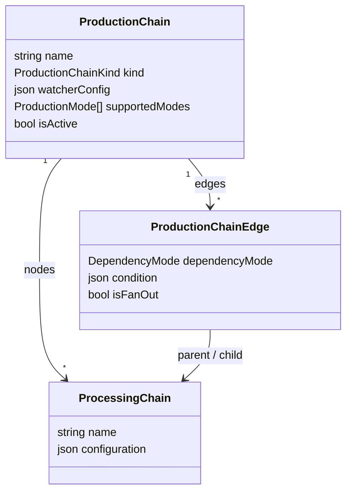
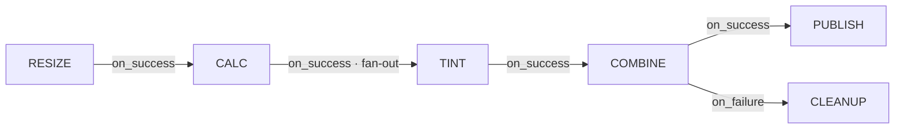

# ProductionChain, nodes, and DAG

A **`ProductionChain`** is the definition of a production chain: a **DAG** (directed acyclic graph) whose nodes reuse [`ProcessingScript`](/docs/concepts/processing-script) entities. It belongs to a [`Project`](/docs/concepts/project).

## Three entities, not one

The graph is described with **three** entities, which lets the same script be reused across multiple chains (and multiple times within a single chain):

- **`ProductionChain`** — the chain itself (name unique per project, supported modes, kind).
- **`ProcessingChain`** — a **node**: the instantiation of a `ProcessingScript` at a given position in the graph. It carries a local `configuration`.
- **`ProductionChainEdge`** — a directed **edge** from a parent node to a child node, carrying the **dependency mode**, an optional **condition**, and the **fan-out** flag.

:::note Why edges between `ProcessingChain` nodes and not between `ProcessingScript` entities?
Because the same script can appear several times in a chain. Edges link **nodes** (`ProcessingChain`), not scripts, removing any ambiguity and allowing repeated sub-graphs.
:::

## Example: the Warhol chain

- **RESIZE** resizes the input image.
- **CALC** computes the grid and **decides the number of tints**.
- **TINT** is a **fan-out**: DPMC creates *N* parallel executions, one per tint.
- **COMBINE** waits for all tints and then assembles the grid.
- **PUBLISH** publishes the final product (on success); **CLEANUP** is only triggered **on failure** of COMBINE.

This is the repository's reference example (`packages/prisma/src/constants/production-chain.ts`). The second seed chain, **DPMC_TST**, models a simple reprocessing flow `IPF_L1 → IPF_L2`.

## Dependency modes

An edge's `dependencyMode` field defines what must happen to the **parent** to unblock the **child**:

| Mode               | The child starts when…                                                        |
| ------------------ | ----------------------------------------------------------------------------- |
| `on_success`       | all relevant parents have **succeeded** (default). If a parent fails/skips, the child is *skipped*. |
| `on_failure`       | at least one parent has **failed** (compensation branches, e.g. `CLEANUP`).   |
| `on_completion`    | all parents are **terminated**, regardless of outcome.                        |
| `on_data_available`| an **expected piece of data is available** (data-driven triggering).          |
| `optional`         | never blocking — the edge is purely informational.                            |

The exact resolution (and the `waiting → ready` / `skipped` transitions of Jobs) is performed by the dispatcher: see [Scheduler](/docs/architecture/scheduler#dependency-loop).

## Fan-out

An edge with `isFanOut = true` indicates that the **number of children is not known at definition time**: it is determined at runtime by the parent. In Warhol, `CALC → TINT` is a fan-out — `CALC` produces a grid descriptor, and DPMC then materializes *N* `TINT` `Batch` instances, grouped by `fanOutGroupId`. The complete mechanism is described in [Task, Batch, and Job](/docs/concepts/task-batch-job#fan-out).

## Chain kinds and watcher

`ProductionChainKind` distinguishes:

- **`standard`** — triggered explicitly (manual, API, ingestion hook).
- **`watcher`** — auto-triggered periodically by the dispatcher according to `watcherConfig` (e.g. monitoring the arrival of new data). See [Triggering](/docs/architecture/triggering).

## Chain parameters

A chain can declare **parameters** (`ProductionChainParameter`) that will be requested when a Task is launched: `name`, `kind` (`string` / `number` / `select`), `defaultValue`, `options`, `isMandatory`. Warhol exposes `gridWidth`, `gridHeight`, `colorize`, `inputPath`.

## Integrity rules

- The graph must remain **acyclic**.
- Any node referenced by an edge must exist in the chain.
- A chain without edges is valid (its nodes execute in parallel).

## See also

- [ProcessingScript and versions](/docs/concepts/processing-script)
- [Task, Batch, and Job](/docs/concepts/task-batch-job)
- [Full data model](/docs/architecture/data-model)
