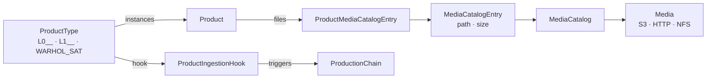

# Products and catalog

DPMC is **data**-centric: what it produces and consumes are **products** organized by **type**, stored on **media**, and declared in a **catalog**. The arrival of a product can itself **trigger** a production.

## ProductType

A **`ProductType`** classifies products by nature and processing level.

| Field             | Role                                                              |
| ----------------- | ----------------------------------------------------------------- |
| `acronym`         | Unique code (e.g., `DPMC_TST_L0__`, `WARHOL_SAT`).                |
| `processingLevel` | Level (`L0`, `L1`, `L2`, `ADF`…).                                 |
| `category`        | `static_aux`, `dynamic_aux`, or `measurement`.                    |

## Product

A **`Product`** is a concrete instance (a file, or a set of files).

| Field           | Role                                                          |
| --------------- | ------------------------------------------------------------- |
| `productTypeId` | The type.                                                     |
| `name` / `version` | Product identity (`name + version` unique).                |
| `parentBatchId` | The Batch that produced it (lineage traceability).            |
| `parameters`    | Free-form metadata (JSON).                                    |

DPMC can ingest **existing catalogs in bulk**: the `seedProducts` seed imports millions of products in batches from an external database, and `seedSources` pushes demo files to MinIO (S3) while building the associated media catalog.

## Media catalog

The **where** is decoupled from the **what**:

- **`Media`** — a storage system (`s3`, `http`, `https`, `nfs`).
- **`MediaCatalog`** — a logical catalog within a medium (e.g., `WARHOL_SAT`).
- **`MediaCatalogEntry`** — a concrete entry: `path` (e.g., `s3://bucket/products/…`) and `size`.
- **`ProductMediaCatalogEntry`** — the join table between a product and its files (a product can have multiple entries, and an entry can be shared).

This decoupling lets the same product exist on multiple media (replication, multi-site) without duplicating its definition.

## Triggering by ingestion

A **`ProductIngestionHook`** links a `ProductType` to a `ProductionChain`: "when a product of this type is inserted, create a `Task` for this chain."

| Field              | Role                                                          |
| ------------------ | ------------------------------------------------------------- |
| `productTypeId`    | The triggering type.                                          |
| `productionChainId`| The chain to launch.                                          |
| `projectId`        | The project that owns the created Task.                       |
| `productionMode`   | Production mode of the created Task (e.g., `reprocessing`).   |
| `enabled`          | Enables / disables the hook.                                  |

The implementation is a **PostgreSQL trigger** (`fn_product_ingestion_hook`): on every `INSERT` into `product`, it inserts a `Task` with status `queued` for each matching active hook. This is the **data-driven** triggering mode, closest to operational EO reality. See [Triggering](/docs/architecture/triggering).

## See also

- [Triggering — all modes](/docs/architecture/triggering)
- [Task, Batch, and Job](/docs/concepts/task-batch-job)
- [Carbon footprint — data volume](/docs/architecture/carbon-footprint)
