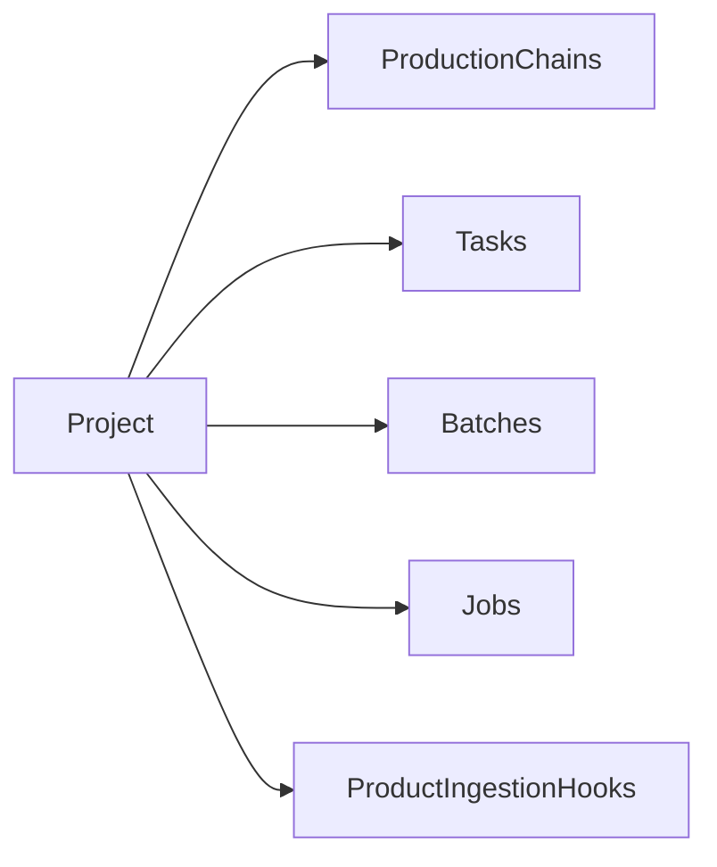

# Project — the tenant

A **`Project`** is DPMC's unit of multi-tenancy. Almost every execution entity (`Task`, `Batch`, `Job`) and definition entity (`ProductionChain`) belongs to a project. It serves three purposes: **isolating** data, **authorizing** access, and **weighting** resource sharing.

## Notable fields

| Field                    | Role                                                                                  |
| ------------------------ | ------------------------------------------------------------------------------------- |
| `identifier`             | Unique short key (e.g. `dpmc-default`), used by seeds and integrations.               |
| `name` / `comment`       | Human-readable label and description.                                                  |
| `isActive`               | An inactive project no longer schedules new production.                                |
| `isDefault`              | The "default" project for flows not explicitly attached to one.                       |
| `priorityWeight`         | Scheduler **fairness** weight (see below). Default `1.0`.                              |
| `allowedProductionModes` | The `ProductionMode` values this project is allowed to use.                            |

## Weighted fairness between projects

The scheduler does not rely on a single global priority queue: it factors the project's `priorityWeight` into the **effective priority** computation of a Job. A project with `priorityWeight = 2.0` sees its jobs progress twice as fast, at equal priority and class, as a project with `1.0`. This prevents a large project from starving the others. The calculation details are in [Scheduler](/docs/architecture/scheduler).

## Production modes

`ProductionMode` qualifies the **intent** of a production and constrains both the chains usable and the default priority class:

| Mode           | Typical use                                              |
| -------------- | -------------------------------------------------------- |
| `nominal`      | Routine operational production.                          |
| `test`         | Validation, non-operational.                             |
| `reprocessing` | Massive reprocessing campaign of a historical archive.   |
| `on_demand`    | One-off user request.                                    |
| `on_the_fly`   | On-the-fly production, low latency.                      |
| `hpc`          | Execution on a high-performance computing center.        |
| `generic`      | Neutral default mode.                                    |

A project declares the set of modes it allows (`allowedProductionModes`); a `ProductionChain` declares the modes it supports (`supportedModes`). The intersection determines what is actually launchable.

## Priority classes

Independently of the mode, each `Task` / `Batch` carries a `PriorityClass` that weighs heavily in scheduling:

| Class          | Weight (indicative) | Use                                    |
| -------------- | ------------------- | -------------------------------------- |
| `test`         | 0.5                 | Tests, no urgency.                     |
| `on_demand`    | 1.0                 | Standard request.                      |
| `reprocessing` | 1.2                 | Background reprocessing.               |
| `nrt`          | 5.0                 | *Near-Real-Time*.                      |
| `super`        | 100                 | High priority.                         |
| `ultra`        | 1000                | Absolute urgency, jumps the queue.     |

:::tip[Design] Users and roles
Identity (`User`, `Session`) comes from **Keycloak**; the fine-grained binding of users to projects and to RBAC roles is described in [Security](/docs/architecture/security). The "user ↔ project" association beyond global roles remains an open design point.
:::

## See also

- [Scheduler — fairness and effective priority](/docs/architecture/scheduler)
- [Security — RBAC and Keycloak](/docs/architecture/security)
