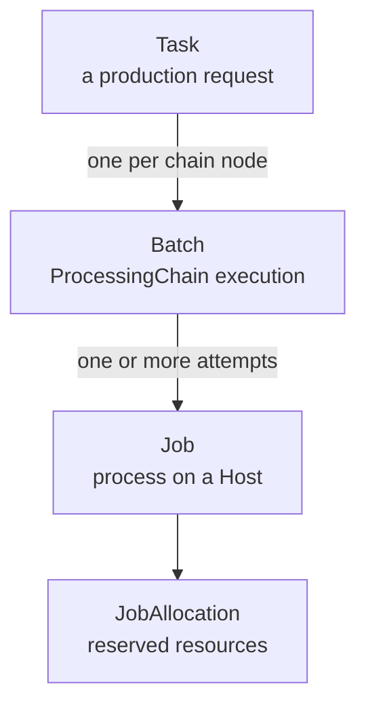
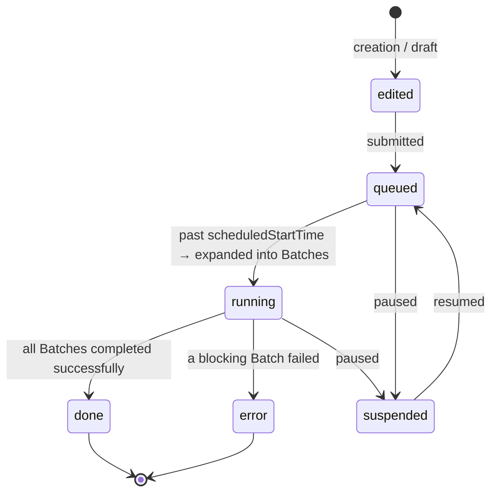
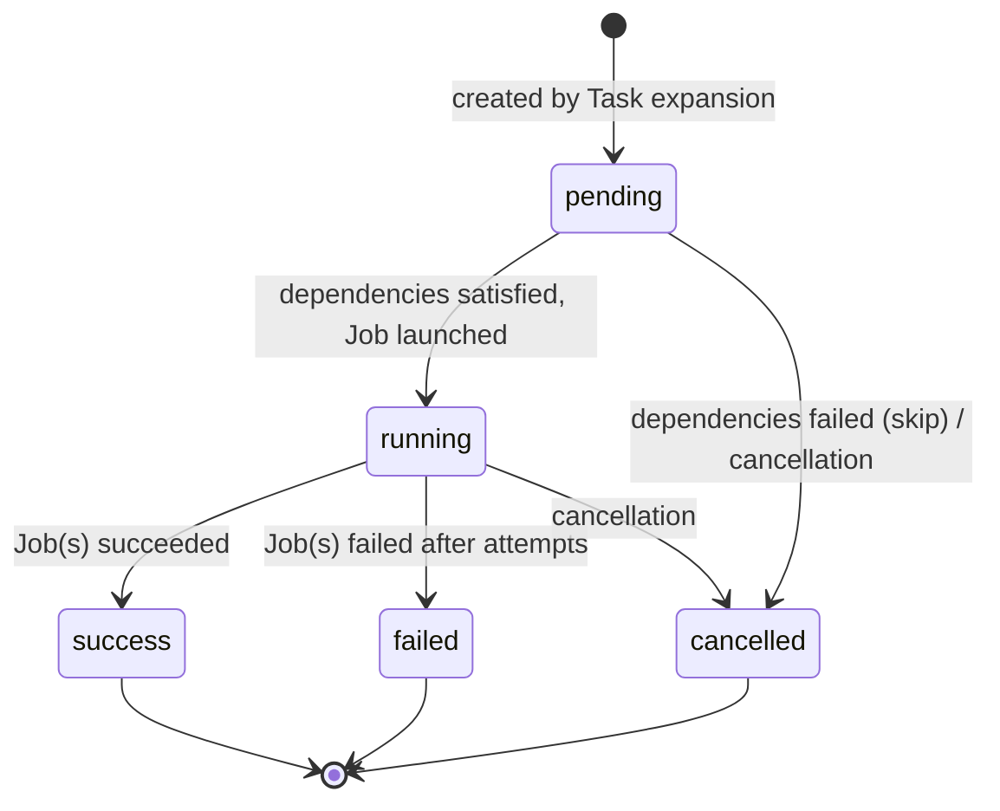
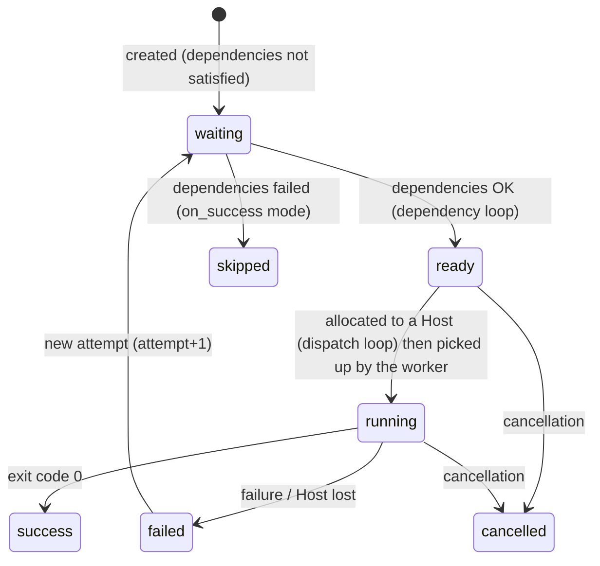

# Task, Batch, and Job

Execution in DPMC happens at **three levels**. This is the most important change compared to the initial model (where "Batch" referred to the execution of a chain and "Task" to the execution of a script).

| Level     | Answers…                                  | Carries…                                                  |
| --------- | ----------------------------------------- | --------------------------------------------------------- |
| **Task**  | "*What do we want to produce?*"           | the chain, the mode, the priority class, the target product. |
| **Batch** | "*Which step, in what context?*"          | the `ProcessingChain` node, the SXAC, the replay, the fan-out. |
| **Job**   | "*Which process, on which machine?*"      | the Host, the PID, the attempt, the metrics, the energy.  |

## Task — the production request

A **`Task`** is a **request**, not a process. It can target a whole chain (`kind = chain`) or a standalone script (`kind = standalone`).

| Field                | Role                                                                  |
| -------------------- | --------------------------------------------------------------------- |
| `executionTag`       | **Unique** tag that links all Batches/Jobs of an execution.           |
| `kind`               | `chain` or `standalone`.                                              |
| `productionChainId`  | The chain to execute (if `chain`).                                    |
| `processorVersionId` | The SXAC to use (if `standalone`).                                    |
| `productId`          | The triggering product (for ingestion hooks).                         |
| `status`             | `edited`, `queued`, `running`, `done`, `error`, `suspended`.          |
| `productionMode` / `priorityClass` | Mode and priority class (see [Project](/docs/concepts/project)). |
| `scheduledStartTime` | When the Task should start (scheduling).                              |
| `temporalContext`    | Temporal window of the processed data (JSON).                         |

### Task lifecycle

On transition to `running`, the dispatcher calls the API to **expand** the Task: DPMC walks the chain's nodes and creates one `Batch` per node (status `pending`).

## Batch — execution of a node

A **`Batch`** is the execution of **one** `ProcessingChain` (a DAG node) within a Task. All Batches of a Task share its `executionTag`.

| Field              | Role                                                                |
| ------------------ | ------------------------------------------------------------------- |
| `taskId`           | The parent Task.                                                    |
| `processingChainId`| The executed node.                                                  |
| `processorVersionId`| The resolved SXAC.                                                 |
| `fanOutGroupId`    | Groups the Batches resulting from the same fan-out.                 |
| `parentBatchId`    | **Replay** link: a replayed Batch points to the original.           |
| `poolId`           | Target Host pool.                                                   |
| `status`           | `pending`, `running`, `success`, `failed`, `cancelled`.             |
| `input` / `output` / `parameters` / `constraints` | Data and constraints (JSON). |

### Batch lifecycle

## Job — the process on a Host

A **`Job`** is the concrete execution of a Batch on a `Host`: a process, an **attempt**. A Batch can generate multiple Jobs (retry).

| Field                | Role                                                          |
| -------------------- | ------------------------------------------------------------- |
| `batchId`            | The parent Batch.                                             |
| `processingScriptVersionId` / `processorVersionId` | The software and SXAC executed. |
| `hostId`             | Host assigned (on transition to `ready`).                     |
| `status`             | `waiting`, `ready`, `running`, `success`, `failed`, `skipped`, `cancelled`. |
| `attempt`            | Attempt number.                                               |
| `pid`                | PID of the process on the Host side.                          |
| `resolvedImage`      | Container image actually launched.                            |
| `effectivePriority`  | Priority computed by the scheduler (with *aging*).            |
| `avgPower` / `dataVolume` / `metrics` | Collected measurements (energy, volume, CPU…). |
| `outputDir`          | Artifacts directory.                                          |
| `lastError`          | Last error in case of failure.                                |

### Job lifecycle

The `JobAllocation` materializes the **reservation** of resources (`reservedCpu`, `reservedRam`, `reservedDisk`, `gpuIndices`) on the Host, and is **released** (`releasedAt`) when the Job ends.

## Fan-out

When a Job whose outgoing edge is `isFanOut` completes, the API expands the fan-out: it creates *N* child Batches (one per item produced by the parent), all stamped with the same `fanOutGroupId`. In Warhol, `CALC` finishes and DPMC then creates one `TINT` Batch per tint. `COMBINE`, which depends on `TINT` in `on_success`, waits until **all** Batches of the group have succeeded.

## Who drives these transitions?

Everything is driven by the **dispatcher** (loops `task`, `dependency`, `dispatch`, `monitor`, `aging`, `watcher`, `finalizer`) and the **API** (expansion, fan-out). Details are in [Scheduler](/docs/architecture/scheduler).

## See also

- [Scheduler — the dispatcher loops](/docs/architecture/scheduler)
- [Edge dependency modes](/docs/concepts/production-chain#dependency-modes)
- [Host, DataCenter, and Pool](/docs/concepts/host-datacenter)
