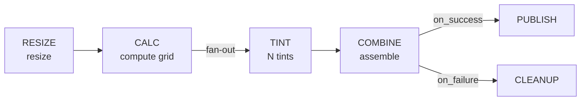

# Welcome to DPMC

**DPMC** (*Data Production Management Core*) is a generic orchestrator for **Earth Observation (EO) data processing**. It handles data ingestion, cataloging, processing configuration, and large-scale execution of production chains on cloud, on-premise, or HPC infrastructures.

This repository implements the **EOCP** generation (*Evolution of Orchestrator for Complex Processing*) of DPMC: a modular, *API-first* and *container-native* rewrite that introduces production / processing chains, multi-site orchestration, role-based security, and environmental footprint tracking.

:::info Documentation **and** design document
This documentation serves a dual role: describing **what is implemented today** (data model, API, dispatcher, worker) and making explicit the **design intentions** still in progress. Sections marked :::tip[Design] describe a target that is not yet (or only partially) delivered. It also serves as support for realigning the original design document.
:::

## What does DPMC do?

- 🧠 **Orchestration** — `ProductionChain` entities embedding `ProcessingChain` nodes, with rich dependency rules (`on_success`, `on_failure`, convergence, conditional, data availability).
- ⚖️ **Smart scheduling** — *Best-Fit-Decreasing* bin-packing across nodes, weighted fairness between projects, *aging* to prevent starvation, GPU-aware placement.
- 🎯 **Multiple triggering modes** — manual, API, scheduled (cron), event-driven, data-driven (post-ingestion).
- 📦 **Container runtimes** — Docker (cloud / on-prem), Apptainer (HPC), selected per project.
- 🌐 **Multi-site / master-slave** — distributed DPMC instances coordinating over REST API (*cloud-bursting*, federation, disaster recovery).
- 🔐 **Security** — OAuth2 / JWT via Keycloak, RBAC (*external-viewers / internal-viewers / operators / admins*), all database access going through the API.
- 🔢 **Versioning** — coexistence of multiple processor versions (SXAC = *Software × Auxiliary Configuration*) and multiple product versions.
- 🌱 **Environmental footprint** — CO₂e estimates per job and per project from CPU, storage, and transfers (PUE-aware).

## The Warhol walkthrough

To explore the concepts without an EO domain context, the repository ships with a demonstration chain called **Warhol** that transforms an image into an Andy Warhol-style colored grid:

`CALC` dynamically decides the number of tints; the `CALC → TINT` edge is a **fan-out**: DPMC creates as many `TINT` `Batch` instances as needed at runtime. This is the most direct illustration of the engine's mechanisms (DAG, fan-out, conditional dependencies). A second seed chain, **DPMC_TST**, illustrates an `L0 → L1 → L2` reprocessing pattern.

## Documentation map

| Section                                               | Content                                                                                       |
| ----------------------------------------------------- | --------------------------------------------------------------------------------------------- |
| [**Concepts**](/docs/concepts/overview)               | The vocabulary: Project, ProductionChain, ProcessingScript, Task / Batch / Job, Products, Host. |
| [**Architecture**](/docs/architecture/overview)       | Components, data model (ERD), scheduler, triggering, security, CO₂ footprint, multi-site.     |
| [**Getting started**](/docs/getting-started/install)  | Local installation (Docker Compose), CLI and web console.                                      |
| [**Roadmap**](/docs/roadmap)                          | What is delivered, in progress, and decisions still open.                                      |
